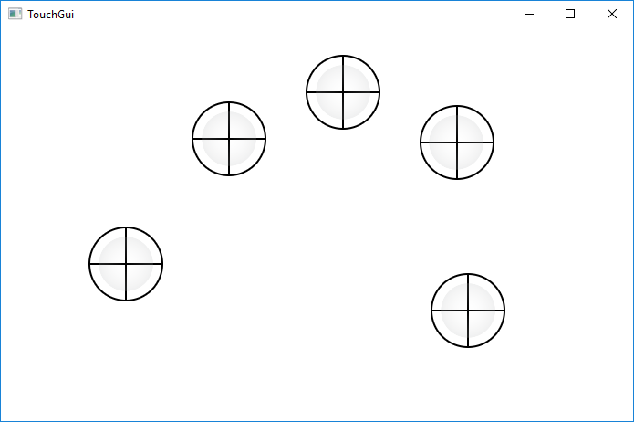

# MultitouchFX

A simple JavaFX program for visualizing multitouch events on computers where the OS supports multitouch (for the moment this is Windows 8 and 10; Windows 7, too, but you may have to install stuff for it).

My program comes as a NetBeans project but you could easily just use the source code in any IDE.

The program is running in full screen mode. When reduced to a simple window (ESC) it looks like this:

In the code you will find a class that takes care of drawing the cursor which you may want to customize.

(c) 2017 [Michael Kipp](http://michaelkipp.de)
